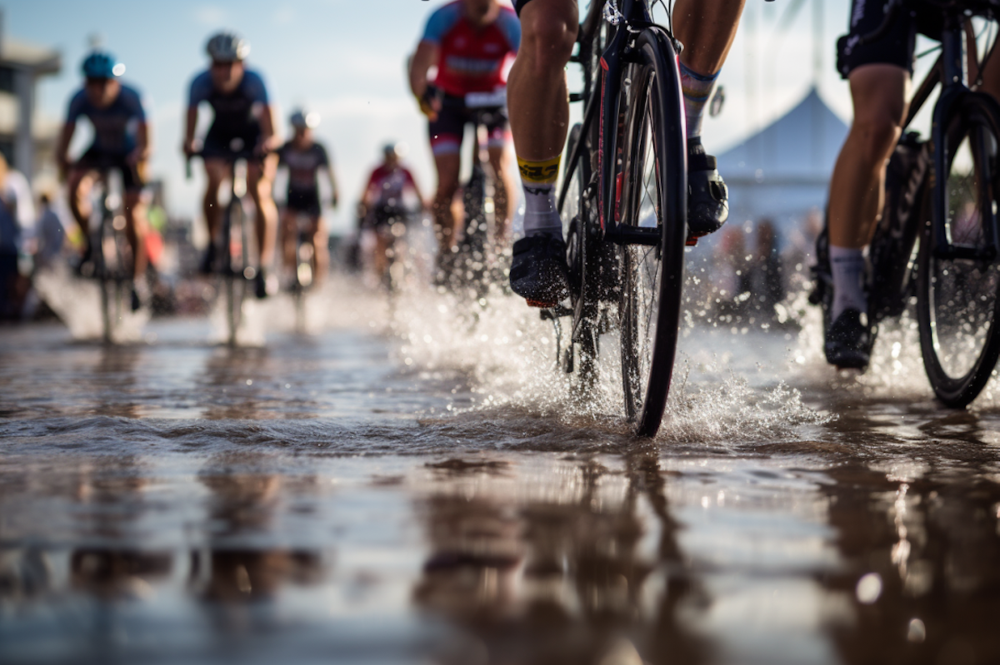

# Cómo pretendemos cambiar la industria del deporte

El deporte, en su esencia más pura, es la convergencia entre **pasión**, **esfuerzo** y **conocimiento**. Sin embargo, en la era de la información, la verdadera transformación no se logra únicamente con entrenamiento ni talento, sino con la **integración profunda de la ciencia y la tecnología avanzada**. En _Datletix_, esa es nuestra convicción y nuestro motor.

El ciclismo, un deporte que exige precisión, resistencia y estrategia, se enfrenta hoy a un desafío fundamental: la enorme cantidad de datos generados queda en gran medida **infrautilizada**. La diferencia entre el estancamiento y la excelencia radica en la capacidad para interpretar estos datos con rigor científico y traducirlos en **decisiones inteligentes**.

### Nuestra misión y objetivo

En Datletix, **nuestra misión** es clara: aplicar el conocimiento científico y la tecnología de punta para transformar la forma en que se entiende y se practica el deporte, con un enfoque inicial en el ciclismo profesional y amateur. Buscamos **empoderar a atletas, entrenadores y equipos** con herramientas que les permitan optimizar cada aspecto del rendimiento, desde la preparación física hasta la estrategia en competencia.

El **objetivo** de Datletix es crear un ecosistema innovador que:

- **Recolecte, interprete y potencie datos deportivos** con precisión científica.
- Utilice **inteligencia artificial y análisis predictivo** para anticipar lesiones y maximizar resultados.
- Promueva una cultura de **mejora continua basada en evidencia objetiva**.
- Revolucione la industria deportiva mediante un enfoque **tecnológico, personalizado y escalable**.

### La revolución del rendimiento

Datletix no es solo una plataforma tecnológica; es un compromiso con la **excelencia y la innovación**. A través de soluciones robustas y personalizadas, habilitamos un nuevo paradigma donde cada pedalada, cada ritmo cardíaco y cada variable ambiental se convierten en una ventaja competitiva.

Este enfoque integral permite:

- Interpretar con precisión **multidimensional** los datos biométricos y de entrenamiento.
- Desarrollar modelos predictivos que **previenen lesiones** y maximizan el rendimiento.
- Implementar estrategias basadas en **análisis de alto impacto y evidencias objetivas**.
- Fomentar un ciclo continuo de **mejora y adaptación en tiempo real**.

Con esta visión, Datletix abre un nuevo capítulo en la historia del deporte, donde el conocimiento científico no es un lujo, sino la base imprescindible para la **innovación y el liderazgo**.

Más que transformar el ciclismo, pretendemos **revolucionar la manera en que el deporte entiende su futuro**, estableciendo un estándar de excelencia que marcará el camino para las próximas generaciones.

_El futuro del deporte es científico, es inteligente, es Datletix._
